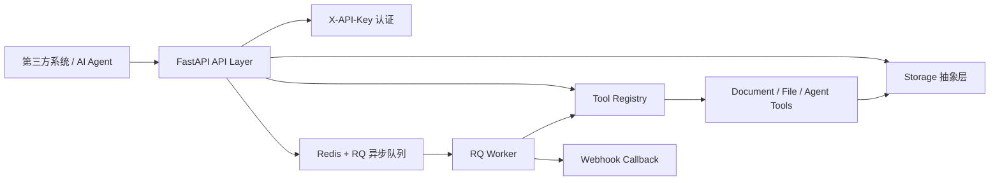

# Python AI Tool Server 系统说明文档

## 1. 系统定位

Python AI Tool Server 是一个面向 AI Agent 和第三方系统的工具型 Web API 服务。

它的核心目标是把文档转换、文件处理、网页处理、格式化校验等常见能力统一封装成 HTTP API，让外部系统可以通过标准接口调用这些工具，而不需要关心底层依赖、命令行工具或文件存储细节。

典型使用场景：

- AI Agent 调用工具完成文档转换。
- 第三方业务系统上传文件并获取转换结果。
- 内部平台统一管理 PDF、Word、Markdown、HTML 等文件处理能力。
- 将本地工具能力封装成可扩展 API 网关。

## 2. 总体架构



系统分为以下层次：

- API 层：负责 HTTP 接口、参数校验、认证、响应封装。
- 工具注册层：统一管理所有 tool，通过 `tool_name` 查找执行器。
- 工具执行层：实现具体转换或处理逻辑。
- 存储层：负责上传文件、输出文件、临时文件管理。
- 异步任务层：通过 Redis/RQ 支持长耗时任务。
- 回调层：异步任务完成后可选通知调用方。

## 3. 调用链路

### 3.1 一步上传转换下载

适合小到中等文件，调用最简单。

```text
POST /v1/convert/download
```

链路：

```text
上传文件 -> API 保存文件 -> 根据 tool_name 找工具 -> 执行转换 -> 保存结果 -> 返回文件流
```

示例：

- 上传 `.md`
- `tool_name=md_to_word`
- 直接返回 `.docx` 下载流

适合直接下载文件流的工具：

- `md_to_word`
- `md_to_pdf`
- `word_to_pdf`
- `pdf_to_word`
- `html_to_pdf`
- `archive_create`
- `images_to_pdf`

不适合此接口的工具：

- `text_extract`
- `file_metadata`
- `webpage_to_markdown`
- `json_yaml_format`

这些工具返回文本或 JSON，不返回文件流，应使用 `/v1/tools/{tool_name}/run`。

### 3.2 标准同步调用

适合需要先上传文件，再复用 `file_id` 的场景。

```text
POST /v1/files
POST /v1/tools/{tool_name}/run
GET  /v1/files/{result_file_id}
```

链路：

```text
上传文件 -> 获取 file_id -> 同步执行工具 -> 获取 result_file_id -> 下载结果
```

### 3.3 异步任务调用

适合大文件、耗时任务或不希望 HTTP 长时间阻塞的场景。

```text
POST /v1/tools/{tool_name}/jobs
GET  /v1/jobs/{job_id}
GET  /v1/jobs/{job_id}/result
```

链路：

```text
提交任务 -> RQ 入队 -> Worker 执行 -> 保存结果 -> 查询状态/下载结果 -> 可选 Webhook
```

任务状态：

- `queued`：等待执行。
- `running`：正在执行。
- `succeeded`：执行成功。
- `failed`：执行失败。

## 4. API 接口说明

### 4.1 健康检查

```text
GET /health
```

用途：

- 检查服务是否启动。

返回示例：

```json
{
  "status": "ok",
  "service": "python-ai-tool-server"
}
```

### 4.2 上传文件

```text
POST /v1/files
```

用途：

- 上传一个源文件到服务。
- 返回 `file_id`，供后续工具调用使用。

请求类型：

```text
multipart/form-data
```

参数：

- `file`：要上传的文件。

返回示例：

```json
{
  "file_id": "a1b2c3.md",
  "filename": "demo.md",
  "content_type": "text/markdown",
  "size": 128,
  "url": null
}
```

### 4.3 下载文件

```text
GET /v1/files/{file_id}
```

用途：

- 根据上传接口或工具结果返回的 `file_id` 下载文件。

### 4.4 查询工具列表

```text
GET /v1/tools
```

用途：

- 查看当前系统支持的所有工具。
- 查看每个工具的功能说明、入参 schema、是否支持同步调用、超时时间。

### 4.5 同步执行工具

```text
POST /v1/tools/{tool_name}/run
```

用途：

- 同步执行指定工具。
- 适合小文件或短任务。

请求示例：

```json
{
  "input": {
    "file_id": "a1b2c3.md",
    "output_filename": "result.pdf"
  }
}
```

返回示例：

```json
{
  "status": "succeeded",
  "result": {
    "type": "file",
    "data": null,
    "result_file_id": "d4e5f6.pdf",
    "filename": "result.pdf",
    "content_type": "application/pdf"
  }
}
```

### 4.6 创建异步任务

```text
POST /v1/tools/{tool_name}/jobs
```

用途：

- 创建异步工具任务。
- 适合大文件、耗时转换或需要回调通知的场景。

请求示例：

```json
{
  "input": {
    "file_id": "a1b2c3.pdf"
  },
  "callback_url": "https://example.com/tool-callback"
}
```

返回示例：

```json
{
  "job_id": "f8f2b19d-8d31-4f70-89e7-7ec8a10b6b28",
  "status": "queued"
}
```

### 4.7 查询异步任务状态

```text
GET /v1/jobs/{job_id}
```

用途：

- 查询异步任务当前状态。

### 4.8 获取异步任务结果

```text
GET /v1/jobs/{job_id}/result
```

用途：

- 任务成功后获取执行结果。
- 文件类工具会直接返回文件流。
- 文本或 JSON 类工具会返回 JSON。

### 4.9 一步上传转换下载

```text
POST /v1/convert/download
```

用途：

- 上传文件。
- 指定 `tool_name`。
- 服务完成转换后直接返回文件下载流。

请求类型：

```text
multipart/form-data
```

参数：

- `file`：要转换的源文件。
- `tool_name`：要执行的工具名，例如 `md_to_word`。
- `output_filename`：可选输出文件名，例如 `result.docx`。
- `extra_input`：可选 JSON 字符串，例如 `{"encoding":"utf-8"}`。

示例：

```text
file = demo.md
tool_name = md_to_word
output_filename = result.docx
extra_input = {"encoding":"utf-8"}
```

### 4.10 一步上传解析或 OCR

```text
POST /v1/process/run
```

用途：

- 上传一个文件并直接执行返回文本或 JSON 的工具。
- 适合 `document_parse`、`image_ocr`、`pdf_ocr`、`image_annotate_layout`。

参数：

- `file`：需要处理的文件。
- `tool_name`：例如 `document_parse` 或 `pdf_ocr`。
- `extra_input`：可选 JSON 字符串，例如 `{"language":"chi_sim+eng"}`。

## 5. 模块说明

### 5.1 API 模块

路径：`app/api/routes`

- `files.py`：文件上传和下载。
- `tools.py`：工具发现、同步调用、异步任务创建。
- `jobs.py`：异步任务状态查询和结果获取。
- `convert.py`：一步上传、转换、下载接口。
- `deps.py`：API Key 认证、Storage 和 Queue 依赖注入。
- `docs.py`：Swagger/OpenAPI 文档说明常量。

### 5.2 Tool 模块

路径：`app/tools`

- `base.py`：工具基类、统一结果结构、错误结构。
- `registry.py`：工具注册中心。
- `document.py`：Word/PDF/Markdown 文档转换。
- `file_tools.py`：文本提取、文件元信息、压缩解压、图片转 PDF。
- `agent_tools.py`：网页转 Markdown、HTML 转 PDF、JSON/YAML 格式化等 Agent 常用工具。
- `utils.py`：外部命令检测、命令执行、MIME 类型辅助。

### 5.3 Storage 模块

路径：`app/storage`

当前实现为本地文件存储：

```text
data/uploads   上传文件
data/outputs   工具输出文件
data/tmp       临时转换目录
```

存储层已经通过 `Storage` 抽象，后续可以扩展为 MinIO、S3、阿里云 OSS 等对象存储。

### 5.4 Jobs 模块

路径：`app/jobs`

- 使用 Redis + RQ 执行异步任务。
- Worker 根据 `tool_name` 调用注册工具。
- 任务状态包括 `queued`、`running`、`succeeded`、`failed`。
- 任务完成后可选调用 `callback_url`。

### 5.5 Callback 模块

路径：`app/callbacks`

- `webhook.py`：负责向第三方系统发送任务完成回调。
- 回调失败会记录日志，不影响任务本身结果。

### 5.6 Core 配置模块

路径：`app/core/config.py`

主要配置项：

- `API_KEYS`：逗号分隔的 API Key 列表。
- `REDIS_URL`：Redis 连接地址。
- `STORAGE_ROOT`：本地文件存储目录。
- `PUBLIC_BASE_URL`：服务公开访问地址。
- `JOB_TIMEOUT_SECONDS`：任务超时时间。
- `FILE_TTL_SECONDS`：文件保留时间。
- `WEBHOOK_TIMEOUT_SECONDS`：Webhook 请求超时时间。

## 6. 技术特点

- FastAPI 自动生成 Swagger/OpenAPI 文档。
- 使用 `X-API-Key` 做轻量认证。
- 工具插件化注册，新增工具只需实现 `BaseTool` 并注册。
- 同时支持同步调用、异步任务和一步下载流接口。
- 文件存储与工具执行解耦。
- 文档转换优先使用 LibreOffice、Pandoc、wkhtmltopdf 等成熟工具。
- Markdown 转 Word/PDF 在缺少 Pandoc 时提供 Python fallback。
- 统一错误结构，便于第三方系统处理异常。
- 本地存储已经抽象，可平滑替换为对象存储。

## 7. 已支持功能

### 7.1 文档转换

| 工具名 | 功能 | 输入 | 输出 | 依赖 |
| --- | --- | --- | --- | --- |
| `word_to_pdf` | Word 转 PDF | `.doc`, `.docx` | `.pdf` | LibreOffice |
| `pdf_to_word` | PDF 转 Word | `.pdf` | `.docx` | pdf2docx |
| `md_to_word` | Markdown 转 Word | `.md` 或 Markdown 文本 | `.docx` | Pandoc 或 Python fallback |
| `md_to_pdf` | Markdown 转 PDF | `.md` 或 Markdown 文本 | `.pdf` | Pandoc 或 Python fallback |
| `html_to_pdf` | HTML 转 PDF | `.html` 或 HTML 文本 | `.pdf` | wkhtmltopdf、Pandoc 或 Python fallback |

### 7.2 文件工具

| 工具名 | 功能 |
| --- | --- |
| `text_extract` | 从 TXT、Markdown、JSON、YAML、HTML、PDF、DOCX 提取文本 |
| `file_metadata` | 查询文件元信息 |
| `archive_create` | 多个文件打包 ZIP |
| `archive_extract` | 解压 ZIP |
| `images_to_pdf` | 多张图片合并为 PDF |

### 7.3 Agent 常用工具

| 工具名 | 功能 |
| --- | --- |
| `webpage_to_markdown` | 网页内容转 Markdown |
| `webpage_to_html` | 获取网页 HTML，可选清理脚本和样式 |
| `http_request` | 发送 GET/POST/PUT/PATCH/DELETE HTTP 请求 |
| `json_yaml_format` | JSON/YAML 校验和格式化 |
| `url_screenshot` | 使用 Playwright Chromium 生成网页截图 |

### 7.4 知识库与 OCR 工具

| 工具名 | 功能 | 说明 |
| --- | --- | --- |
| `word_to_md` | DOCX 转 Markdown 文件 | 可用于知识库导入 |
| `pdf_to_md` | PDF 提取并生成 Markdown 文件 | 文本型 PDF 效果最佳 |
| `document_parse` | 通用文档解析 | 支持 PDF、DOCX、XLSX、PPTX、HTML、TXT、Markdown |
| `pdf_parse` | PDF 知识解析 | `document_parse` 的 PDF 专用入口 |
| `word_parse` | Word 知识解析 | `document_parse` 的 DOCX 专用入口 |
| `excel_parse` | Excel 知识解析 | 按工作表返回内容 |
| `ppt_parse` | PPT 知识解析 | 按幻灯片返回内容 |
| `html_parse` | HTML 知识解析 | 转换为 Markdown 内容 |
| `txt_parse` | TXT 知识解析 | 返回文本章节 |
| `md_parse` | Markdown 知识解析 | 返回 Markdown 章节 |
| `img_parse` | 图片知识解析 | 基于 OCR 返回文本 |
| `image_ocr` | 图片 OCR | 依赖本机 Tesseract |
| `pdf_ocr` | PDF 页面 OCR | 依赖 Tesseract 和 PyMuPDF |
| `image_annotate_layout` | 图片文字框识别与标注 | 返回标注图片及文本框数据 |
| `chunks_data_parse` | 文本切片 | 支持 chunk size 和 overlap |
| `bm25_preprocess` | BM25 检索预处理 | 返回规范化文本和 tokens |

### 7.5 外部集成工具

| 工具名 | 功能 | 说明 |
| --- | --- | --- |
| `send_email_smtp` | SMTP 邮件发送 | 调用时传入 SMTP 配置，可携带已有文件附件 |
| `jira_search_issues` | Jira JQL 查询 | 支持 basic token 或 bearer token |
| `jira_get_issue` | 获取 Jira 任务详情 | 传入 issue key |
| `jira_create_issue` | 创建 Jira 任务 | 传入 Jira REST fields |
| `jira_transition_issue` | Jira 状态流转 | 传入 transition id |
| `jira_add_attachment` | 上传 Jira 附件 | 使用本服务中已上传的 file_id |

## 8. 认证与安全

所有业务接口使用 `X-API-Key` 认证。

开发环境默认：

```text
X-API-Key: dev-api-key
```

生产环境建议通过 `.env` 或环境变量设置：

```text
API_KEYS=system-a-key,system-b-key,internal-agent-key
```

当前版本定位为内网或受控第三方系统调用，不包含完整多租户权限体系。

## 9. 错误结构

工具执行错误统一返回：

```json
{
  "detail": {
    "code": "invalid_input",
    "message": "Missing required field: file_id",
    "details": {}
  }
}
```

常见错误码：

- `unauthorized`：缺少或错误的 API Key。
- `tool_not_found`：工具不存在。
- `sync_not_supported`：工具不支持同步执行。
- `invalid_input`：参数不合法。
- `missing_dependency`：缺少系统依赖。
- `conversion_failed`：转换失败。
- `job_not_found`：任务不存在。
- `job_not_succeeded`：任务尚未成功完成。

## 10. Windows 本地运行注意事项

如果不是 Docker 运行，需要本机自行安装外部依赖：

- LibreOffice：用于 `word_to_pdf`。
- Pandoc：用于高质量 Markdown/HTML 转换。
- wkhtmltopdf：用于 HTML 转 PDF。

如果调用 `word_to_pdf` 时出现：

```json
{
  "code": "missing_dependency",
  "message": "LibreOffice 'soffice' is required for Word to PDF conversion."
}
```

说明 Windows 本机没有安装 LibreOffice，或者 `soffice.exe` 没有加入 PATH。

典型路径：

```text
C:\Program Files\LibreOffice\program\soffice.exe
```

安装后需要重启服务。

## 11. Docker 运行说明

项目提供了 `Dockerfile` 和 `docker-compose.yml`。

Docker 镜像中会安装：

- LibreOffice
- Pandoc
- wkhtmltopdf
- CJK 字体
- Poppler 工具

启动命令：

```bash
docker compose up --build
```

服务地址：

```text
http://localhost:8000
```

Swagger 文档：

```text
http://localhost:8000/docs
```

## 12. 扩展方式

新增一个工具通常只需要三步：

1. 在 `app/tools` 下新增工具类，继承 `BaseTool`。
2. 实现工具元信息：
   - `name`
   - `description`
   - `input_schema`
   - `sync_supported`
   - `timeout_seconds`
3. 在 `app/tools/registry.py` 的 `register_builtin_tools()` 中注册该工具。

工具执行方法示例：

```python
def execute(self, input_data: dict, storage: Storage) -> ToolResult:
    ...
```

返回文件：

```python
return ToolResult(
    type="file",
    result_file_id=stored["file_id"],
    filename=stored["filename"],
    content_type=stored["content_type"],
)
```

返回文本或 JSON：

```python
return ToolResult(type="text", data={"text": "..."} )
```

## 13. 可扩展功能规划

后续可以按以下方向继续扩展：

- OCR 增强：PaddleOCR/VL、表格和版面恢复、模型服务化。
- PDF 工具：PDF 合并、拆分、加水印、压缩、提取图片。
- Office 工具：Excel 转 PDF、PPT 转 PDF、Word 内容替换。
- 对象存储：接入 MinIO、S3、OSS。
- 权限体系：从 API Key 扩展到多租户、配额、调用审计。
- 任务管理：任务取消、重试、进度百分比、任务过期清理。
- Agent 工具集：结构化网页提取、浏览器自动化会话、反爬配置。
- 管理后台：查看工具列表、任务记录、文件记录、失败日志。

## 14. 当前边界

- `word_to_pdf` 依赖 LibreOffice。
- `url_screenshot` 需要安装 Playwright Chromium：`playwright install chromium`。
- OCR 类工具需要 Windows 本地安装 Tesseract OCR 并配置 PATH。
- `pdf_to_word` 是尽力转换，扫描版 PDF 不保证可用。
- 当前认证是 API Key，不包含用户体系和角色权限。
- 当前默认本地文件存储，多实例部署时建议扩展对象存储。
